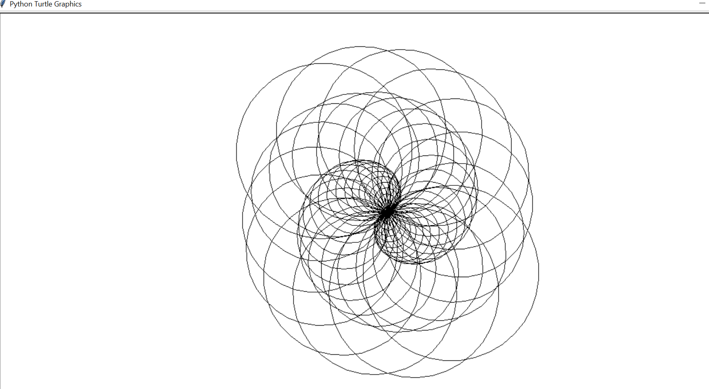
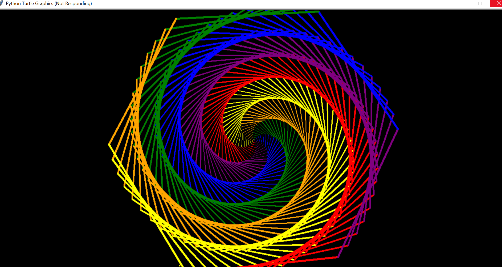
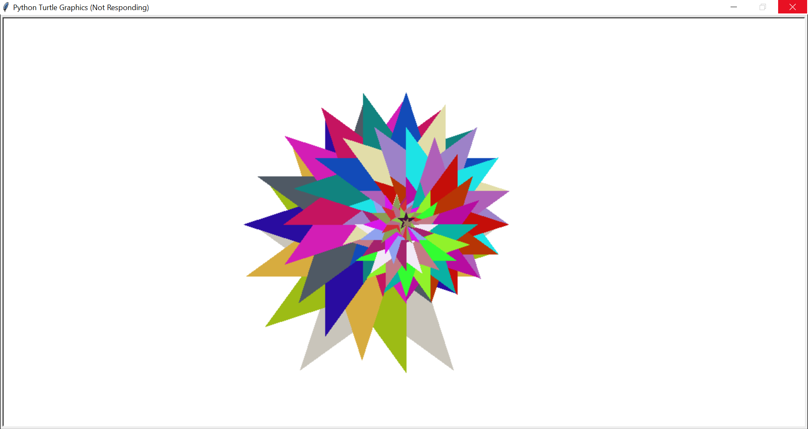
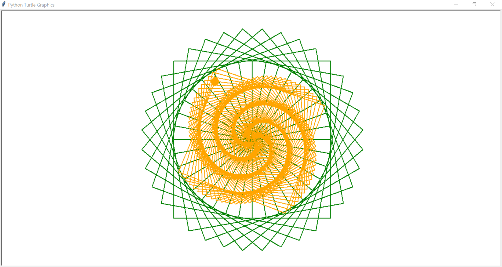
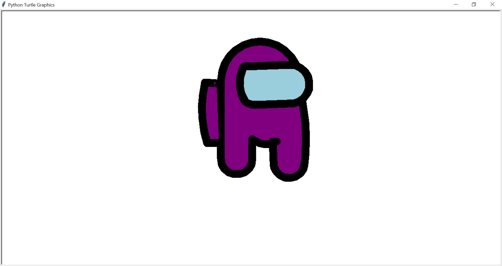
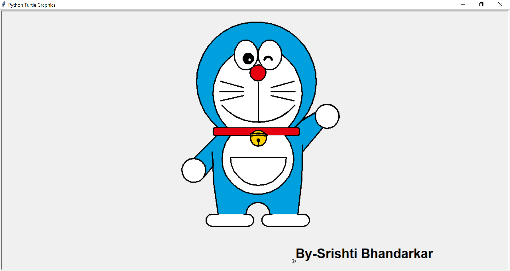

# Turtle Graphics With Python :turtle:
#### “Turtle” is a Python feature like a drawing board, which enables users to create pictures and shapes by providing them with a virtual canvas.:grinning:
### Simple Turtle graphics design to draw Pattern with Circle 

### Simple code to draw Colourful Spiral Design

### Simple code to draw Stars in loop to create beautiful turtle graphics

### Simple code to draw Rangoli Design with 2 colours

### Program to draw Among Us with Python turtle :)

### Program to Draw Doremon with Python turtle (*~*)

